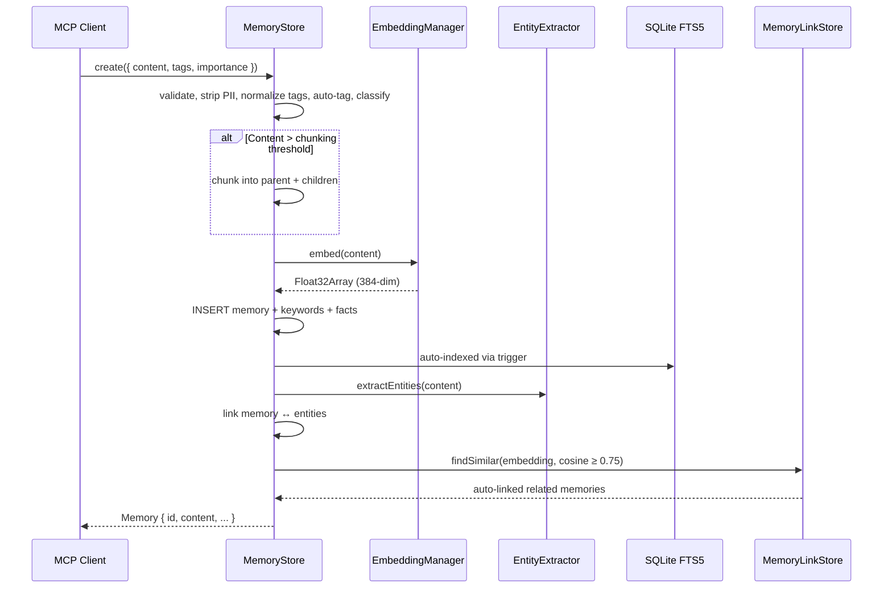
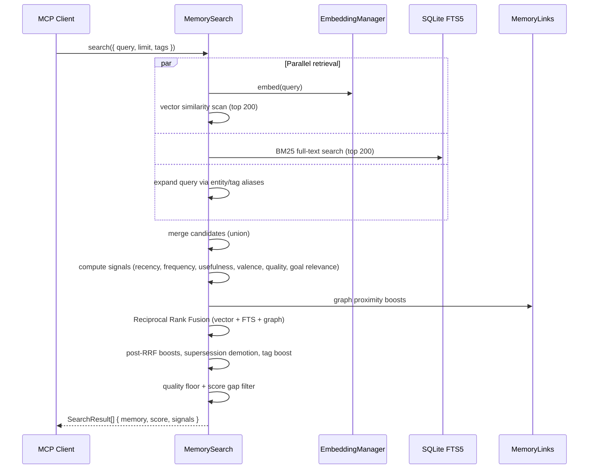

# Exocortex Architecture

## System Overview

```
┌─────────────────────────────────────────────────────┐
│                    MCP / REST API                    │
├─────────────────────────────────────────────────────┤
│                                                     │
│  ┌─────────────┐  ┌─────────────┐  ┌────────────┐  │
│  │   Memory     │  │  Entities   │  │   Goals    │  │
│  │  store       │  │  extractor  │  │  predict   │  │
│  │  search      │  │  graph      │  │  track     │  │
│  │  ingest      │  │  profiles   │  │            │  │
│  └──────┬───────┘  └──────┬──────┘  └─────┬──────┘  │
│         │                 │               │         │
│  ┌──────▼─────────────────▼───────────────▼──────┐  │
│  │            Intelligence Layer                  │  │
│  │  consolidation · contradictions · decay        │  │
│  │  importance · maintenance · scoring            │  │
│  │  graph-densify · co-retrieval · synthesis      │  │
│  └──────────────────────┬────────────────────────┘  │
│                         │                           │
│  ┌──────────────────────▼────────────────────────┐  │
│  │              Foundation                        │  │
│  │  SQLite + FTS5  ·  ONNX embeddings (384-dim)  │  │
│  └───────────────────────────────────────────────┘  │
│                                                     │
└─────────────────────────────────────────────────────┘
```

## Key Flows

### 1. Memory Storage

What happens when you call `memory_store`:



### 2. Memory Search (RAG Retrieval)

What happens when you call `memory_search`:



### 3. Intelligence Pipeline (Overnight)

What the sentinel jobs do while you sleep:

```
┌─────────────────────────────────────────────────────────┐
│                  Sentinel Scheduler                      │
└────────┬──────────┬──────────────┬──────────────────────┘
         │          │              │
    ┌────▼────┐ ┌───▼──────┐ ┌────▼─────────┐
    │ Memory  │ │ Entities │ │   Quality    │
    ├─────────┤ ├──────────┤ ├──────────────┤
    │boost/   │ │backfill  │ │8 health      │
    │ decay   │ │ entities │ │ checks       │
    │consoli- │ │densify   │ │retrieval     │
    │ date    │ │ graph    │ │ regression   │
    │contra-  │ │recompute │ │adaptive      │
    │ dictions│ │ profiles │ │ weight tuning│
    └─────────┘ │prune     │ └──────────────┘
                │ orphans  │
                └──────────┘
         │          │              │
    ┌────▼──────────▼──────────────▼──────────┐
    │           Self-Improvement               │
    │  gardening · insights · weekly scorecard │
    └──────────────────────────────────────────┘
```

### 4. Scoring Pipeline Detail

How a single memory gets scored during search:

```
  Raw Signals (0–1 each)          RRF Fusion              Post-RRF              Output
 ─────────────────────     ─────────────────────    ──────────────────    ─────────────
  vector similarity ────► vector rank  (w: 0.45) ─┐
                                                   ├─► 1/(k+rank+1) ─► × signal boosts
  FTS BM25 rank ────────► FTS rank     (w: 0.25) ─┤   sum across      (recency, freq,
                                                   │   ranked lists     usefulness,
  graph proximity ──────► graph rank   (w: 0.10) ─┘                    valence, quality,
                                                                        goal relevance)
  recency ──────────────────────────────────────────────────────┐
  frequency ────────────────────────────────────────────────────┤
  usefulness ───────────────────────────────────────────────────┼──► × supersede (0.2)
  valence ──────────────────────────────────────────────────────┤    + tag boost
  quality ──────────────────────────────────────────────────────┤    × metadata penalty
  goal relevance ───────────────────────────────────────────────┘
                                                                    ──► quality floor ≥ 0.08
                                                                    ──► score gap ≥ 15%
                                                                    ──► offset + limit
```
