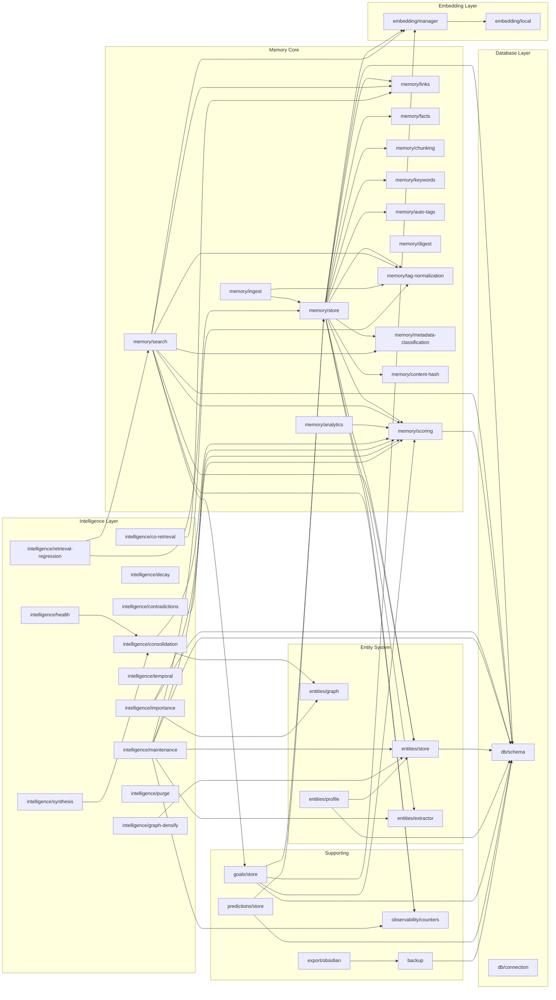
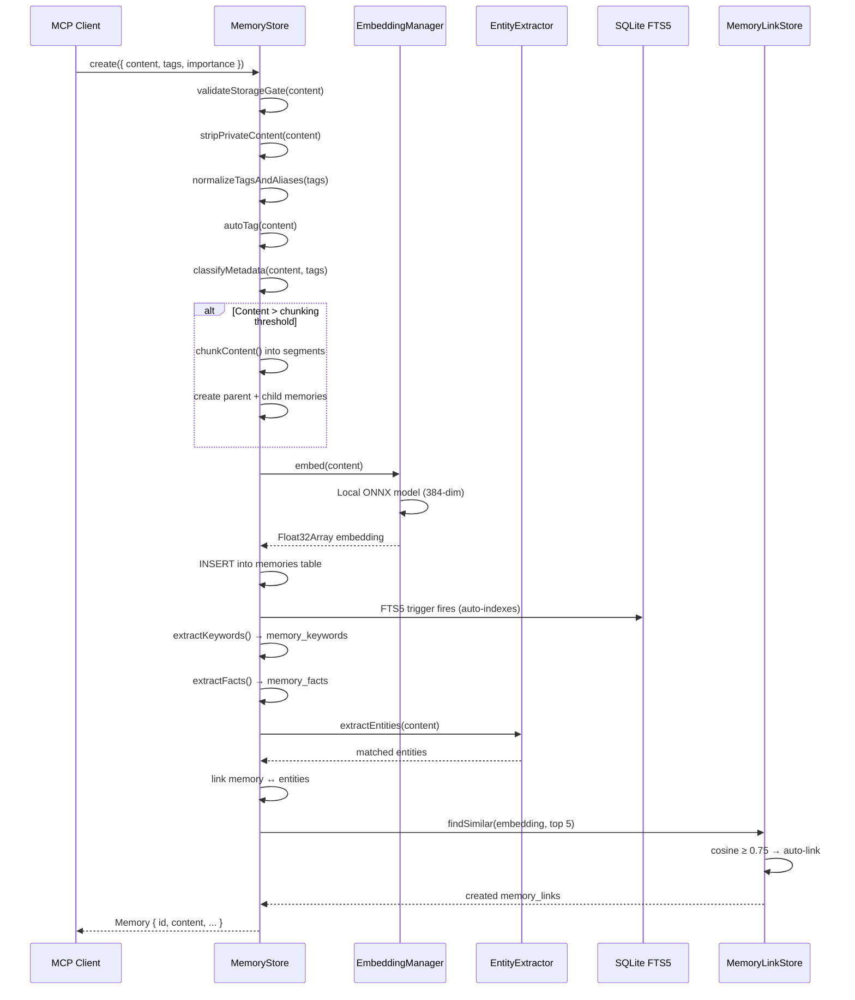
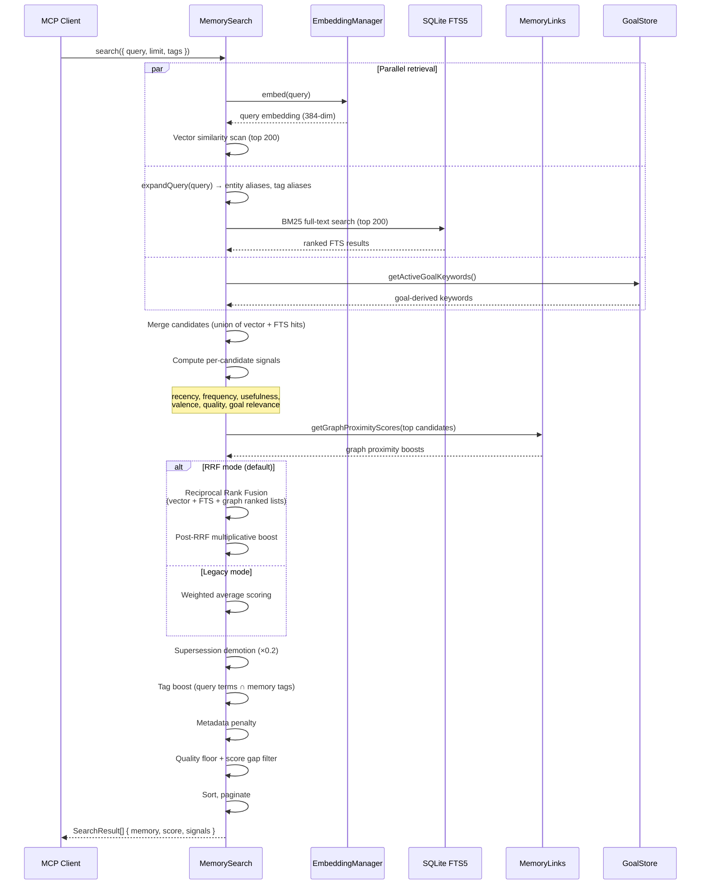
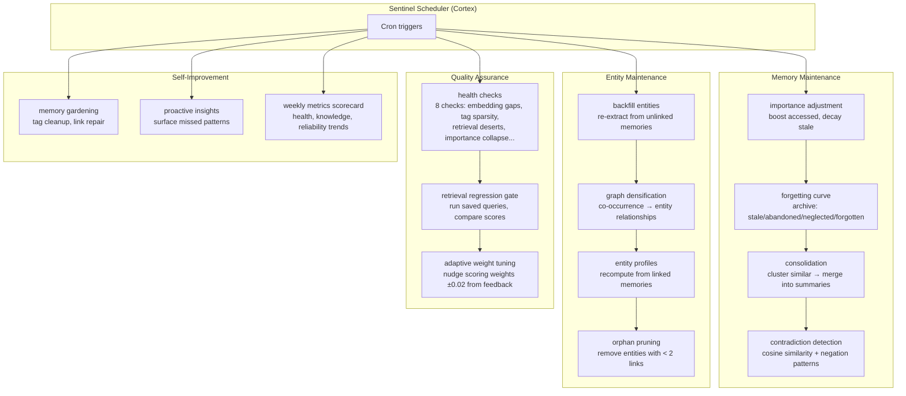
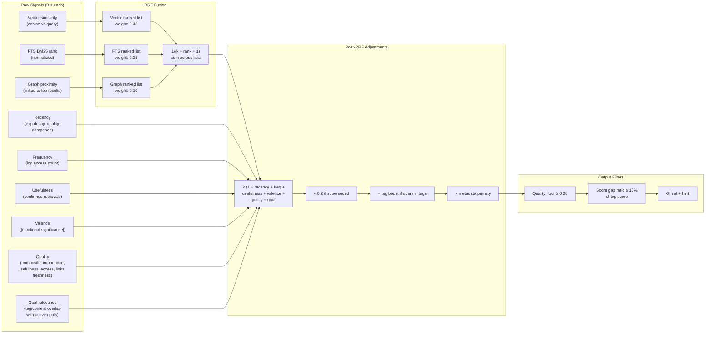

# Exocortex Architecture

## Module Dependency Graph

## Key Flows

### 1. Memory Storage

What happens when you call `memory_store`:

### 2. Memory Search (RAG Retrieval)

What happens when you call `memory_search`:

### 3. Intelligence Pipeline (Overnight)

What the sentinel jobs do while you sleep:

### 4. Scoring Pipeline Detail

How a single memory gets scored during search:

