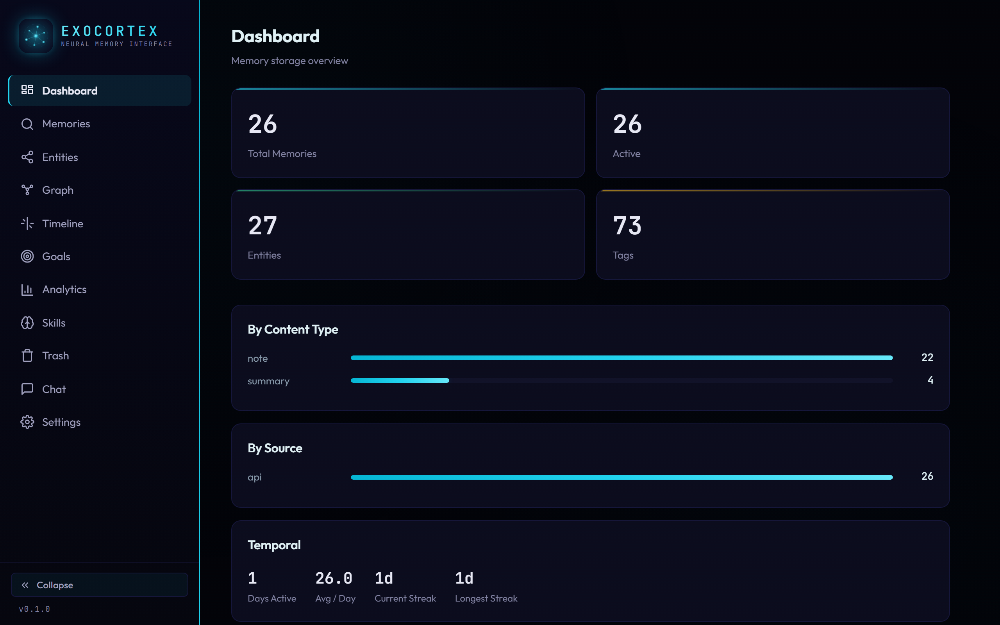
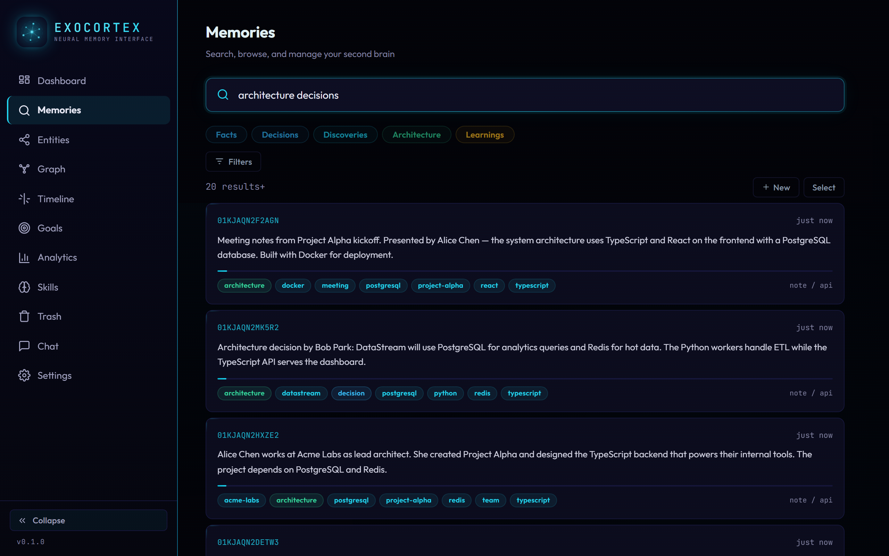
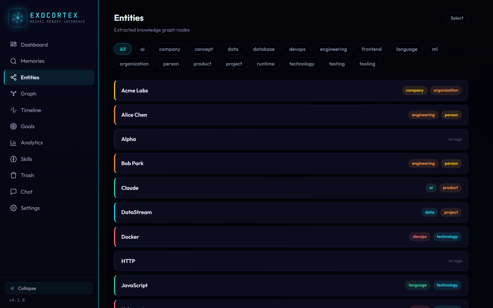
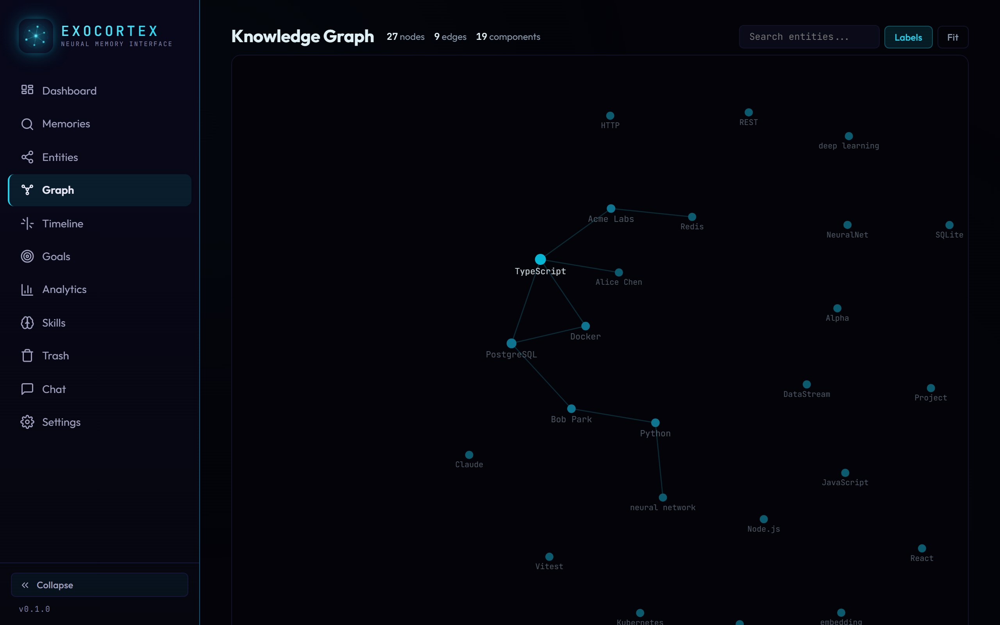
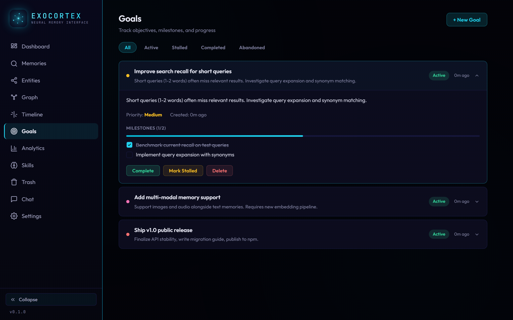
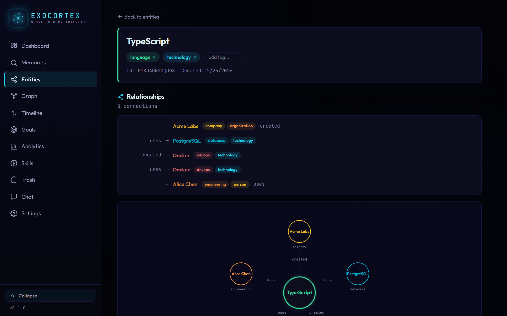

<p align="center">
  
</p>

<h1 align="center">Exocortex</h1>

<p align="center">
  Personal unified memory system — SQLite-backed, local-first, hybrid RAG retrieval with MCP integration.
</p>

<p align="center">
  <a href="#quick-start">Quick Start</a> &middot;
  <a href="#mcp-server">MCP Server</a> &middot;
  <a href="#cli">CLI</a> &middot;
  <a href="#rest-api">REST API</a> &middot;
  <a href="#dashboard-1">Dashboard</a>
</p>

---

Exocortex gives AI coding agents persistent memory across sessions. It stores memories with embeddings, scores them using Reciprocal Rank Fusion, and exposes everything through an MCP server, REST API, CLI, and React dashboard. Works with any MCP-compatible tool — Claude Code, Codex, Gemini, Copilot, and others. All data stays local — no cloud, no API keys for embeddings.

## Dashboard

<p align="center">
  
</p>

<p align="center">
  
</p>

<details>
<summary>More screenshots</summary>

<p align="center">
  
</p>

<p align="center">
  
</p>

<p align="center">
  
</p>

<p align="center">
  
</p>

</details>

---

## Quick Start

Requires **Node.js >= 20** and **pnpm**.

```bash
git clone https://github.com/shawnhack/exocortex.git
cd exocortex
pnpm install
pnpm build        # first build downloads the embedding model (~80MB)
```

Start the server and dashboard:

```bash
pnpm exec exo serve
# → http://localhost:3210
```

Or use the CLI directly:

```bash
pnpm exec exo add "Remember this" --tags "test,demo" --importance 0.8
pnpm exec exo search "remember" --verbose
```

### Connect an AI agent

The MCP server works with any tool that supports the [Model Context Protocol](https://modelcontextprotocol.io):

**Claude Code:**
```bash
claude mcp add --scope user exocortex node /path/to/exocortex/packages/mcp/dist/index.js
```

**Codex CLI** (`~/.codex/config.json`):
```json
{ "mcpServers": { "exocortex": { "command": "node", "args": ["/path/to/exocortex/packages/mcp/dist/index.js"] } } }
```

**Gemini CLI** (`~/.gemini/settings.json`):
```json
{ "mcpServers": { "exocortex": { "command": "node", "args": ["/path/to/exocortex/packages/mcp/dist/index.js"] } } }
```

**VS Code (Copilot / Cline / etc.)** (`.vscode/mcp.json`):
```json
{ "servers": { "exocortex": { "command": "node", "args": ["/path/to/exocortex/packages/mcp/dist/index.js"] } } }
```

---

## How It Works

```
User prompt → Agent reads/writes memories via MCP tools
                ↓
            MCP Server (stdio)
                ↓
          MemoryStore / MemorySearch (core)
                ↓
    ┌───────────┼───────────┐
    │           │           │
 SQLite     FTS5 Index   Vector Store
 (memories)  (full-text)  (384-dim embeddings)
                ↓
    Reciprocal Rank Fusion scoring
    + recency/frequency/usefulness boost
    + graph-aware expansion (1-hop links)
                ↓
     Ranked results + linked context
```

See [ARCHITECTURE.md](ARCHITECTURE.md) for detailed Mermaid diagrams of the module dependency graph, storage flow, search pipeline, intelligence pipeline, and scoring system.

**Key design choices:**
- **No external services** — embeddings run locally via HuggingFace transformers
- **Five-tier knowledge** — working (24h auto-expire), episodic (events, decays), semantic (permanent facts), procedural (permanent techniques), reference (permanent documents). Tier-aware scoring boosts permanent knowledge
- **Hybrid retrieval** — vector similarity + BM25 full-text search, fused with RRF
- **Graph-aware retrieval** — search results include 1-hop linked memories for richer context
- **Usefulness feedback** — memories accessed after search get implicit quality signals, improving future ranking
- **Automatic enrichment** — entity extraction, auto-tagging, and deduplication happen on every write
- **Importance decay** — unused memories lose importance over time, frequently accessed ones gain it
- **Privacy stripping** — `<private>` blocks are stripped before storage/embedding

---

## Packages

| Package | Description |
|---------|-------------|
| `@exocortex/core` | Storage, retrieval, embedding, scoring, entity extraction, intelligence, ingestion |
| `@exocortex/mcp` | MCP server — exposes all memory tools via stdio (works with any MCP client) |
| `@exocortex/server` | Hono REST API on port 3210 + serves the React dashboard |
| `@exocortex/cli` | CLI tool (`exo`) — add, search, import/export, serve, consolidate, retrieval-regression, backfill, verify-backup |
| `@exocortex/dashboard` | React SPA with Neural Interface theme — memories, chat, graph, entities, goals, analytics, library, sources, timeline, skills, trash, mobile-responsive |

---

## MCP Server

The MCP server exposes all Exocortex tools over stdio. See [Quick Start](#connect-an-ai-agent) for setup with your preferred tool.

### Tools

| Tool | Description |
|------|-------------|
| `memory_store` | Store a new memory with tags, importance, content type, and knowledge tier |
| `memory_search` | Hybrid search with RRF scoring, token budgets, and compact mode |
| `memory_get` | Fetch full content for specific memory IDs (use after compact search) |
| `memory_update` | Update content, tags, importance, or content type of an existing memory |
| `memory_forget` | Delete a memory by ID |
| `memory_context` | Load contextual memories for a topic (use at session start) |
| `memory_browse` | Browse memories by tags, type, or date range without semantic search |
| `memory_feedback` | Mark retrieved memories as useful to improve ranking |
| `memory_entities` | List tracked entities with optional tag filtering |
| `memory_timeline` | Query decision history, lineage, or topic evolution over time |
| `memory_ingest` | Index markdown files — splits by `##` headers, deduplicates by `source_uri`, supports globs |
| `memory_link` | Create/remove memory-to-memory links for graph-aware retrieval |
| `memory_digest_session` | Digest a coding session transcript into a structured session summary |
| `memory_maintenance` | Run maintenance: importance adjustment, archival, health checks, search friction, re-embedding, entity backfill, importance recalibration, graph densification, co-retrieval links, adaptive weight tuning, entity orphan pruning |
| `memory_consolidate` | Find and merge clusters of similar memories into summaries |
| `memory_graph` | Entity graph analysis — full graph, bridge detection, community detection |
| `memory_contradictions` | List and resolve detected contradictions between memories |
| `memory_tag_cleanup` | Find and merge near-duplicate tags (preview or apply) |
| `memory_diff` | See what changed since a timestamp — new, updated, and archived memories |
| `memory_project_snapshot` | Quick project snapshot: recent activity, goals, decisions, techniques |
| `memory_decay_preview` | Dry-run preview of what maintenance would archive |
| `memory_ping` | Health check — memory counts, entity/tag stats, date range, uptime |
| `goal_create` | Create a persistent goal |
| `goal_list` | List goals by status |
| `goal_get` | Get goal details with milestones and progress |
| `goal_update` | Update goal fields/status/metadata |
| `goal_log` | Log progress on a goal |
| `goal_add_milestone` | Add a milestone to a goal |
| `goal_update_milestone` | Update milestone title/status/order/deadline |
| `goal_remove_milestone` | Remove a milestone from a goal |
| `memory_facts` | Query structured subject-predicate-object facts extracted from memories |
| `prediction_create` | Create a prediction with claim, confidence, deadline, and domain |
| `prediction_list` | List predictions filtered by status, domain, source, or overdue |
| `prediction_get` | Get full details of a specific prediction |
| `prediction_resolve` | Resolve a prediction as true, false, or partial |
| `prediction_stats` | Calibration statistics: Brier score, calibration curve, overconfidence bias |

### Search workflow

Token-efficient layered retrieval:

```
1. memory_search(query, compact=true)     → IDs + previews + scores (~50 tokens/result)
2. Review results, pick relevant IDs
3. memory_get(ids=[...])                  → Full content for selected memories
```

Or use `max_tokens` to let the server pack results into a token budget:

```
memory_search(query, max_tokens=2000)     → As many full results as fit in 2000 tokens
```

### Session digestion

The `memory_digest_session` tool reads a session transcript JSONL file, extracts meaningful actions (edits, writes, bash commands, web fetches), and stores a structured summary:

```
Session 2026-02-01 (project: exocortex)
- Edit packages/core/src/memory/digest.ts
- Bash: pnpm test
- Bash: git commit -m "Add session digestion"
- Edit README.md

Files changed: 2 | Commands: 2 | Tools used: 2
```

Read-only tools (Read, Glob, Grep) and Exocortex's own MCP calls are filtered out. Consecutive edits to the same file are deduplicated. The project is auto-detected from file paths.

### Stop hook (Claude Code only, optional)

An optional stop hook can remind the agent to store a session summary before exiting substantial sessions. Not enabled by default. To enable, add to `~/.claude/settings.json`:

```json
{
  "hooks": {
    "Stop": [{ "type": "command", "command": "node /path/to/exocortex/packages/mcp/src/hooks/stop.js" }]
  }
}
```

---

## CLI

```bash
pnpm exec exo <command> [options]
```

| Command | Description |
|---------|-------------|
| `add <content>` | Add a new memory. Options: `-t/--tags`, `-i/--importance`, `--type`, `--source` |
| `search <query>` | Hybrid retrieval search. Options: `-l/--limit`, `--after`, `--before`, `-t/--tags`, `--type`, `-v/--verbose` |
| `import <file>` | Import from file. Options: `-f/--format` (json\|markdown\|chatexport), `--dry-run`, `-d/--decrypt`. Structured Exocortex backup JSON is auto-detected and restored directly. |
| `stats` | Show memory statistics — counts, breakdowns by type/source, date range |
| `serve` | Start HTTP server + dashboard. Options: `-p/--port` (default 3210), `-H/--host` (default 127.0.0.1) |
| `mcp` | Start MCP server on stdio |
| `consolidate` | Find and merge similar memories. Options: `--dry-run`, `--similarity`, `--min-size`, `--history` |
| `entities` | List and manage entities. Options: `--type`, `--search`, `--memories` |
| `contradictions` | View and manage contradictions. Options: `--status`, `--detect`, `--resolve <id>`, `--dismiss <id>` |
| `export` | Export JSON backup (memories, entities, goals, links, settings) |
| `obsidian-export` | Export memories to Obsidian-compatible markdown vault |
| `retrieval-regression` | Run golden-query retrieval drift checks and baseline management |
| `verify-backup` | Verify backup integrity — checks row counts, embeddings, entity links |
| `backfill` | Backfill canonical memory state. Options: `--dry-run`, `--limit` |

---

## REST API

### Health

```
GET  /health                    — DB connection status
```

### Memories

```
POST   /api/memories            — Create memory
GET    /api/memories/:id        — Get by ID
PATCH  /api/memories/:id        — Update (content, tags, importance, is_active)
DELETE /api/memories/:id        — Permanent delete
POST   /api/memories/search     — Hybrid search
POST   /api/memories/context-graph — Search + 1-hop linked context
GET    /api/memories/recent     — Recent memories
POST   /api/memories/import     — Bulk import
GET    /api/memories/archived   — List archived/trashed memories
POST   /api/memories/:id/restore — Restore an archived memory
GET    /api/memories/:id/links  — List memory-to-memory links
GET    /api/memories/namespaces — List available namespaces
GET    /api/memories/diff       — Changes since a timestamp (new, updated, archived)
POST   /api/memories/bulk-tag   — Add/remove tags on multiple memories
POST   /api/memories/bulk-update — Bulk update memory fields
```

### Entities

```
GET    /api/entities            — List entities (filter by tags; optional type for manually classified entities)
POST   /api/entities            — Create entity
GET    /api/entities/tags       — List all distinct entity tags
GET    /api/entities/:id        — Get by ID
PATCH  /api/entities/:id        — Update (name, aliases, tags, optional manual type)
DELETE /api/entities/:id        — Delete
GET    /api/entities/:id/memories       — Linked memories
GET    /api/entities/:id/relationships  — Entity relationships
GET    /api/entities/graph              — All entities + relationships (single query)
GET    /api/entities/graph/analysis     — Centrality, communities, stats
```

### Chat

```
POST   /api/chat               — RAG chat (requires ai.api_key in settings)
```

Send `{ message, history?, conversation_id? }`. The server searches memories for context, sends prior conversation history + retrieved context to the configured LLM, and returns `{ response, sources, conversation_id }`. Supports Anthropic (default) and OpenAI providers via `ai.provider` setting.

### Intelligence

```
POST   /api/consolidate         — Find and consolidate memory clusters
GET    /api/consolidations      — Consolidation history
POST   /api/contradictions/detect — Scan for contradictions
GET    /api/contradictions      — List contradictions
GET    /api/contradictions/:id  — Get contradiction by ID
PATCH  /api/contradictions/:id  — Update contradiction (resolve/dismiss)
POST   /api/archive             — Archive stale memories
POST   /api/importance-adjust   — Adjust importance from access patterns
GET    /api/timeline            — Memory timeline with filters
GET    /api/temporal-stats      — Temporal analysis (streaks, averages)
GET    /api/hierarchy           — Temporal hierarchy (epoch → theme → episode)
POST   /api/reembed             — Re-embed memories with missing embeddings
POST   /api/auto-consolidate    — Run auto-consolidation
GET    /api/retrieval-regression/runs   — Regression run history
GET    /api/retrieval-regression/latest — Latest run per-query breakdown
```

### Analytics

```
GET    /api/analytics/summary             — Overview stats (counts, trends)
GET    /api/analytics/access-distribution — Access count distribution
GET    /api/analytics/tag-effectiveness   — Tag usage and effectiveness
GET    /api/analytics/tag-health          — Tag quality metrics
GET    /api/analytics/producer-quality    — Quality by provider/model/agent
GET    /api/analytics/quality-trend       — Quality over time
GET    /api/analytics/quality-distribution — Quality score distribution
GET    /api/analytics/quality-histogram   — Quality score histogram (10 buckets)
GET    /api/analytics/embedding-health    — Embedding coverage and gaps
GET    /api/analytics/decay-preview       — Preview importance decay candidates
GET    /api/analytics/search-misses       — Zero-result queries
GET    /api/analytics/knowledge-gaps      — Detected knowledge gaps
```

### Goals

```
GET    /api/goals              — List goals (default status=active)
GET    /api/goals/:id          — Get goal with progress + milestones
POST   /api/goals              — Create goal
PATCH  /api/goals/:id          — Update goal
DELETE /api/goals/:id          — Delete goal
```

### Predictions

```
GET    /api/predictions        — List predictions (filter by status, domain, source, overdue)
POST   /api/predictions        — Create prediction (claim, confidence, deadline, domain)
GET    /api/predictions/stats  — Calibration stats (Brier score, curve, bias, domain breakdown)
GET    /api/predictions/:id    — Get prediction by ID
PATCH  /api/predictions/:id/resolve — Resolve as true/false/partial
```

### Data

```
GET    /api/export              — Export JSON backup (memories, entities, goals, links, settings)
GET    /api/stats               — Memory statistics
GET    /api/settings            — Get all settings (API keys masked)
PATCH  /api/settings            — Update settings (masked values skipped)
```

Server security defaults:
- Binds to `127.0.0.1` by default.
- CORS is disabled by default. To allow browser cross-origin access, set `EXOCORTEX_CORS_ORIGINS` (comma-separated exact origins).

---

## Scoring

### RRF mode (default)

Reciprocal Rank Fusion fuses two independent ranked lists — vector similarity and FTS5 BM25 — into a single ranking:

```
RRF_score(d) = 1/(k + rank_vector(d)) + 1/(k + rank_fts(d))
```

Where `k = 60` (configurable via `scoring.rrf_k`). Recency and frequency are applied as a multiplicative boost on top. Score range: ~0.001–0.03.

### Legacy mode

Activate with `scoring.use_rrf = false`. Uses a weighted average:

```
score = 0.45 * vector + 0.25 * fts + 0.20 * recency + 0.10 * frequency
```

All weights are configurable via the `settings` table. Score range: ~0.15–0.80.

---

## Retrieval Intelligence

### Usefulness feedback loop

Every memory has a `useful_count` column. When a memory appears in search results and is then fetched via `memory_get` within 5 minutes, the count is implicitly incremented. Explicit feedback via `memory_feedback` also increments it. `usefulnessScore()` uses this count to boost future ranking.

### Adaptive weight tuning

Running `memory_maintenance` with `tune_weights: true` analyzes feedback data and nudges scoring weights ±0.02 per cycle. Over time, the retrieval system self-tunes toward the signals that correlate with usefulness.

### Graph-aware retrieval

Memory-to-memory links (created manually via `memory_link` or automatically) are used during search and context loading. Up to 3 linked memories (1-hop) are appended to results as a "Linked" section, providing richer context without additional queries.

### Valence scoring

Memories can carry an emotional significance field (`valence`, -1 to 1). Both breakthroughs (+1) and failures (-1) boost retrieval via `Math.abs()` — strong emotional signals surface more readily regardless of polarity. Inspired by Damasio's Somatic Marker Hypothesis.

### Store-time relation discovery

On every `memory_store`, the top 200 recent memories are scanned by cosine similarity. Memories with similarity >= 0.75 are automatically linked (up to 5 per write), building the knowledge graph organically.

### Co-retrieval link building

Memories frequently retrieved together in the same search sessions are tracked in the `co_retrievals` table. During maintenance, pairs with enough co-retrieval history are automatically linked, reinforcing natural knowledge clusters.

---

## Intelligence Features

### Consolidation

Greedy agglomerative clustering of semantically similar memories (threshold: 0.75). Clusters of 3+ memories are merged into a basic summary that extracts key facts — dates, metrics, decisions, architecture notes. Source memories are archived and linked to the summary via `parent_id`. LLM-powered synthesis can be handled externally by scheduled maintenance jobs, keeping Exocortex API-cost-free.

Tags like `skill`, `prompt-amendment`, and `goal-progress-implicit` are excluded from propagating to consolidated summaries to prevent semantic pollution.

### Entity Graph Analysis

The entity graph supports three analysis modes via `memory_graph`:
- **Full graph** — all entities and relationships
- **Bridge detection** — entities connecting otherwise-separate clusters (betweenness centrality)
- **Community detection** — label propagation algorithm discovers dense subgraphs, O(V+E) per iteration

### Search Friction Tracking

Zero-result queries are logged to a `search_misses` table, revealing gaps in indexed knowledge. `memory_maintenance` surfaces the top missed queries as "Search Friction Signals", helping identify what knowledge should be stored or better tagged.

### Contradiction detection

Finds memory pairs with high semantic similarity (>0.7) that contain conflicting statements — negations, value changes, or reversed positions. Detected contradictions can be resolved or dismissed.

### Automatic maintenance

Importance adjustment and memory archival run automatically — no manual intervention needed:

- **On server startup** (5-second delay)
- **After every 50 memory stores**
- **Nightly cron jobs** (importance at 3:30 AM, archival at 4:00 AM)

**Importance adjustment** tunes scores based on access patterns:
- **Boost**: Memories accessed 5+ times get importance increased (up to 0.9)
- **Decay**: Never-accessed memories older than 30 days get importance decreased (down to 0.1)
- **Pinned**: Memories with importance 1.0 are never adjusted

**Memory archival** soft-deletes stale memories (`is_active = 0`):
- Low importance (<0.3) + old (>90 days) + rarely accessed (<2 times)
- Never accessed + very old (>365 days)

Additional maintenance operations available via `memory_maintenance`:
- **Entity orphan pruning** — entities with fewer than 2 active memory links are automatically deleted
- **Importance recalibration** — optional percentile-rank normalization of importance distribution
- **Graph densification** — creates co-occurrence relationships between entities sharing memories

**Quality score recompute** recalculates persisted `quality_score` for all memories after importance changes, keeping scores fresh for quality-tiered retrieval. Runs in both periodic maintenance and the nightly importance adjustment.

**Auto tag cleanup** uses string similarity to detect near-duplicate tags (e.g. `react-native` vs `reactnative`) and merges them automatically. Conservative limits: 1 merge per maintenance run, 3 per nightly run, only tags with ≤50 memories.

Consolidation runs nightly at 2:00 AM. Contradiction detection runs at 2:30 AM but is **disabled by default** (`contradictions.auto_detect = false`) — enable it via settings if needed. Entity extraction for unprocessed memories runs nightly at 3:00 AM.

### Temporal analysis

Timeline view of memories grouped by date, with statistics: total active days, average memories per day, most active day, current and longest streaks.

---

## Automatic Enrichment

Memory writes apply three enrichment behaviors. Extraction/tagging are non-blocking (failures don't prevent storage).

### Entity extraction

Regex-based extraction scans memory content with keyword/context heuristics (an optional LLM-based extractor exists at `packages/core/src/entities/llm-extractor.ts`, but is not integrated by default).

Automatic category assignment is disabled: extracted entities are stored as type `concept` by default. The `type` field is manual/editable metadata (API/dashboard), not an automatic classifier at ingest time.

Entities below 0.5 confidence are filtered out at extraction time, removing noisy single-mention concepts.

Entities are linked to memories with relevance scores and can be queried independently. Relationships include optional context phrases extracted from memory content (e.g. "uses -> for real-time event streaming").

### Auto-tagging

When `auto_tagging.enabled = true`, up to 5 tags are generated per memory by matching against:
1. **Tech keywords** — languages, frameworks, databases, tools, platforms
2. **Topic patterns** — decision, bug, architecture, lesson, config, performance, deployment, testing, refactor, security
3. **Project names** — kebab-case identifiers (filtered against a blocklist of common compounds)

Generated tags are normalized through the alias map and merged with user-supplied tags (duplicates ignored).

### Keyword generation

Keywords are generated from content, tags, and entity names, then stored in the `keywords` column for FTS boosting. This gives full-text search additional high-signal terms beyond the raw content.

### Relation discovery

On every `memory_store`, the top 200 recent memories are scanned by cosine similarity. Memories with similarity >= 0.75 are auto-linked (up to 5 per write), building the knowledge graph incrementally without manual intervention.

### Deduplication

Dedup uses two checks:
1. **Hash dedup** — compares against active root memories with the same `content_type` + `content_hash`. Whitespace is normalized before hashing when `dedup.hash_normalize_whitespace` is enabled (default).
2. **Semantic dedup** — for content >= 50 chars with an embedding available, compares against the most recent `dedup.candidate_pool` active root memories (default `200`) of the same content type

Semantic dedup requires cosine similarity >= `dedup.similarity_threshold` (default `0.85`). If incoming tags are provided, at least one tag must overlap the candidate.

Action on match depends on `dedup.skip_insert_on_match`:
- `true` (default): skip insert, return existing memory (`dedup_action = "skipped"`)
- `false`: insert new memory and supersede old one (`is_active = 0`, `superseded_by = new_id`)

---

## Privacy

Content wrapped in `<private>...</private>` tags is stripped before storage, embedding, and indexing. Use this to include context in prompts without persisting sensitive information.

---

## Attribution

Each memory tracks its origin: `provider`, `model_id`, `model_name`, `agent`, `session_id`, `conversation_id`. These are set via MCP tool parameters or environment defaults (`EXOCORTEX_DEFAULT_PROVIDER`, etc.). Attribution enables filtering by source and auditing which model/agent produced a memory.

---

## Database Schema

19 tables + 1 virtual FTS5 table:

| Table | Purpose |
|-------|---------|
| `memories` | Core records — content, embeddings, importance, access tracking, parent/child links |
| `memory_tags` | Many-to-many tag associations |
| `memory_entities` | Junction table linking memories to entities with relevance scores |
| `entities` | Named entities with freeform tags |
| `entity_tags` | Many-to-many tag associations for entities |
| `access_log` | Query access history for importance adjustment |
| `consolidations` | Consolidation history — which memories were merged and how |
| `contradictions` | Detected contradictions with status tracking (pending/resolved/dismissed) |
| `entity_relationships` | Directed relationships between entities with labels and optional context phrases |
| `search_misses` | Zero-result query log for friction analysis |
| `observability_counters` | Lightweight operational counters |
| `memory_links` | Memory-to-memory graph links (`related`, `supports`, etc.) |
| `goals` | Persistent goals with status, priority, deadline, metadata |
| `co_retrievals` | Co-retrieval history used to infer links |
| `retrieval_regression_baselines` | Golden query baseline result IDs |
| `retrieval_regression_runs` | Retrieval regression run history + drift metrics |
| `memory_facts` | Subject-predicate-object triples extracted from memories |
| `predictions` | Forecasting claims with confidence, deadline, and resolution tracking |
| `settings` | Key-value configuration store |
| `memories_fts` | FTS5 virtual table with auto-sync triggers on insert/update/delete |

---

## Configuration

All settings are stored in the `settings` table and can be changed via the REST API (`PATCH /api/settings`) or the dashboard.

### Scoring

| Key | Default | Description |
|-----|---------|-------------|
| `scoring.use_rrf` | `true` | Use Reciprocal Rank Fusion (false = legacy weighted average) |
| `scoring.rrf_k` | `60` | RRF smoothing constant |
| `scoring.rrf_min_score` | `0.001` | Minimum score threshold in RRF mode |
| `scoring.vector_weight` | `0.45` | Vector similarity weight (legacy mode) |
| `scoring.fts_weight` | `0.25` | Full-text search weight (legacy mode) |
| `scoring.recency_weight` | `0.20` | Recency weight (legacy mode) |
| `scoring.frequency_weight` | `0.10` | Frequency weight (legacy mode) |
| `scoring.recency_decay` | `0.05` | Recency decay rate |
| `scoring.min_score` | `0.15` | Minimum score threshold (legacy mode) |
| `scoring.tag_boost` | `0.10` | Score boost for tag matches |
| `scoring.graph_weight` | `0.10` | Graph proximity weight |
| `scoring.usefulness_weight` | `0.05` | Usefulness feedback weight |
| `scoring.valence_weight` | `0.05` | Valence (emotional significance) weight |
| `scoring.quality_weight` | `0.10` | Composite quality score weight |
| `scoring.goal_gated_weight` | `0.15` | Active goal relevance weight |

### Embedding

| Key | Default | Description |
|-----|---------|-------------|
| `embedding.model` | `Xenova/bge-small-en-v1.5` | HuggingFace model identifier |
| `embedding.dimensions` | `384` | Embedding vector dimensions |

### Importance

| Key | Default | Description |
|-----|---------|-------------|
| `importance.auto_adjust` | `true` | Enable automatic importance adjustment |
| `importance.boost_threshold` | `5` | Access count to trigger importance boost |
| `importance.decay_age_days` | `30` | Days before unused memories start decaying |

### Deduplication

| Key | Default | Description |
|-----|---------|-------------|
| `dedup.enabled` | `true` | Enable semantic deduplication |
| `dedup.hash_enabled` | `true` | Enable hash-based deduplication by `content_type` + `content_hash` |
| `dedup.similarity_threshold` | `0.85` | Cosine similarity threshold for semantic dedup |
| `dedup.candidate_pool` | `200` | Number of recent active root memories scanned for semantic dedup |
| `dedup.skip_insert_on_match` | `true` | Reuse existing memory on match instead of inserting + superseding |
| `dedup.hash_normalize_whitespace` | `true` | Normalize whitespace before computing content hash |

### Chunking

| Key | Default | Description |
|-----|---------|-------------|
| `chunking.enabled` | `true` | Split long memories into chunks |
| `chunking.max_length` | `1500` | Character length before chunking triggers |
| `chunking.target_size` | `500` | Target chunk size in characters |

### AI / Chat

| Key | Default | Description |
|-----|---------|-------------|
| `ai.api_key` | — | API key for chat (Anthropic or OpenAI). Masked in GET responses |
| `ai.provider` | `anthropic` | LLM provider (`anthropic` or `openai`) |
| `ai.model` | `claude-sonnet-4-5-20250929` / `gpt-4o-mini` | Model to use for chat |

### Other

| Key | Default | Description |
|-----|---------|-------------|
| `server.port` | `3210` | REST API / dashboard port |
| `auto_tagging.enabled` | `true` | Auto-generate tags on memory creation |
| `contradictions.auto_detect` | `false` | Enable nightly contradiction detection scan |
| `consolidation.auto_enabled` | `true` | Enable auto-consolidation during maintenance |
| `backup.max_count` | `7` | Maximum database backups to retain |

### Tag Normalization

Tags are normalized on read/write through an alias map stored in settings. Define aliases to merge variant spellings: `tag_alias.js = javascript`, `tag_alias.ts = typescript`. All queries and writes go through normalization.

---

## Data Directory

All data is stored in `~/.exocortex/`:

```
~/.exocortex/
  exocortex.db     # SQLite database (memories, entities, settings)
  models/          # Cached embedding model (bge-small-en-v1.5, ~80MB)
```

Override the model cache location with `EXOCORTEX_MODEL_DIR` environment variable.

---

## System Requirements

- **Node.js** >= 20 (uses built-in `node:sqlite`)
- **pnpm** (workspace package manager)
- No external database — SQLite is built into Node
- No API keys — embeddings run locally

---

## Stack

| Component | Technology |
|-----------|-----------|
| Runtime | Node.js >= 20 (built-in `node:sqlite`) |
| Language | TypeScript |
| Package manager | pnpm (workspaces) |
| Server | Hono |
| Dashboard | React 19 + Vite 7 + TanStack Query |
| Validation | Zod 4 |
| Testing | Vitest 4 |
| Embeddings | @huggingface/transformers (bge-small-en-v1.5, 384 dims) |
| MCP | @modelcontextprotocol/sdk |
| IDs | ULID |

---

## Development

```bash
# Install dependencies
pnpm install

# Build all packages
pnpm build

# Run all tests
pnpm test

# Run UI regression checks (layout + interaction flows on desktop/mobile)
pnpm test:ui

# Run memory benchmark (requires ANTHROPIC_API_KEY)
pnpm benchmark          # markdown report
pnpm benchmark --json   # machine-readable output

# Type-check
pnpm lint

# Dev server with watch mode
pnpm dev
```

If this is your first Playwright run on the machine, install Chromium once:

```bash
pnpm exec playwright install chromium
```

---

## License

MIT
